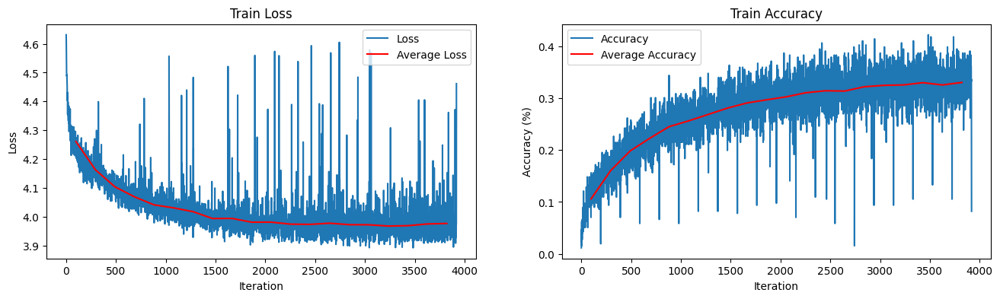

# A Research of Optimizer Scheduling

## Experimental Results

     
    <i>Adam with Fixed Learning Rate (lr=0.01)</i>

 

     
    <i>Adam with Scheduled Learning Rate</i>

 

     
    <i>RAdam with Fixed Learning Rate (lr=0.03)</i>

 