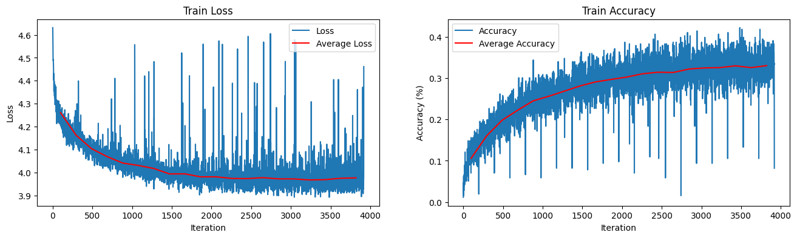
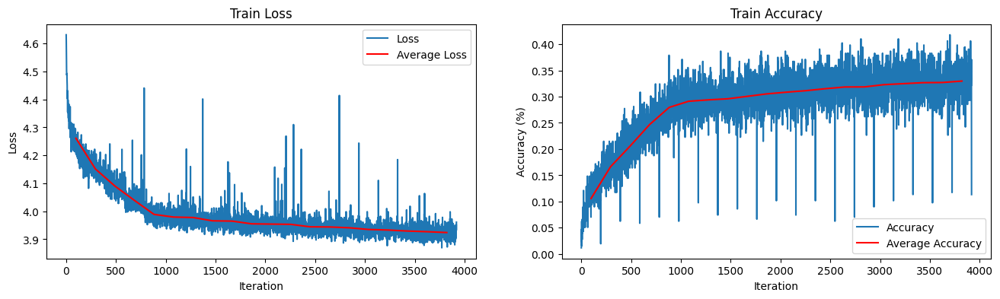
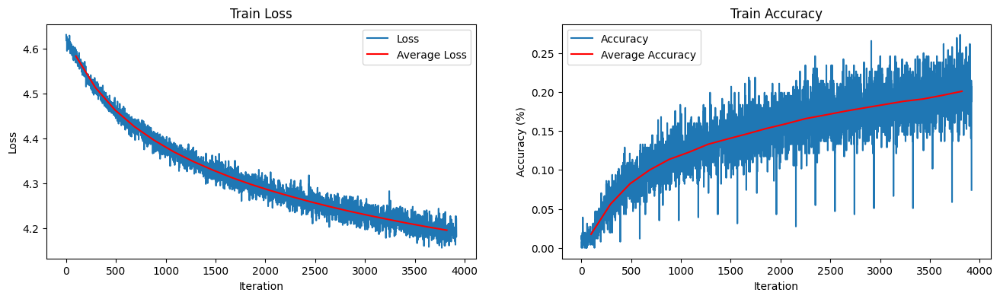
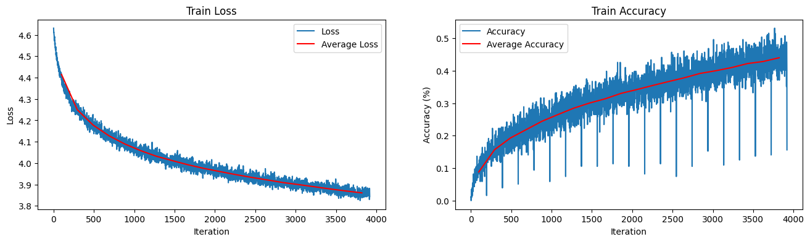
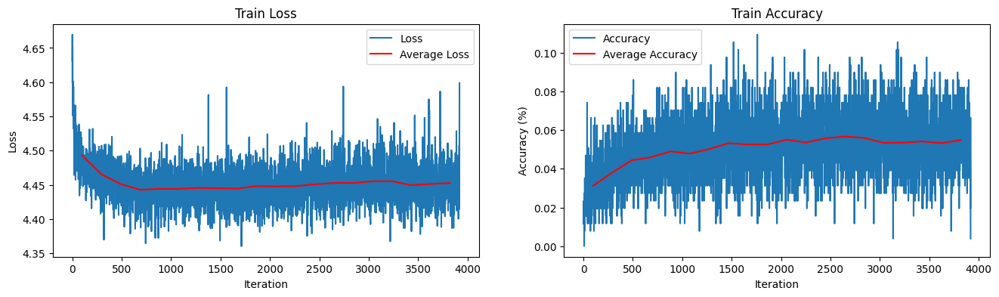
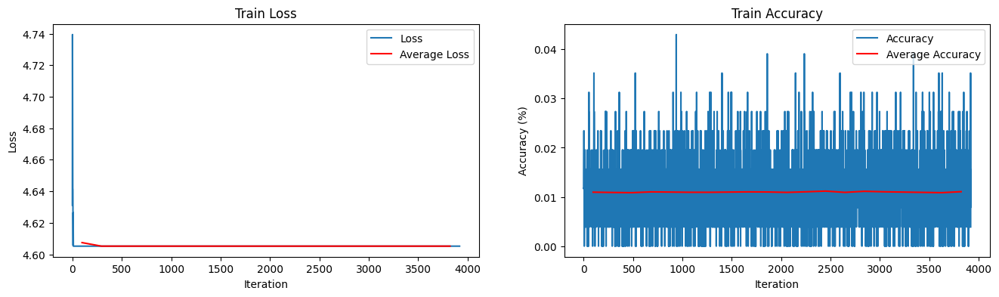

# A Research of Optimizer Scheduling

## Experimental Results

### Adam

     
    <i>Adam with Fixed Learning Rate (lr=0.01)</i>

 

     
    <i>Adam with Scheduled Learning Rate</i>

 

### RAdam

     
    <i>RAdam with Fixed Learning Rate (lr=0.03)</i>

 

### SGD

     
    <i>SGD with Fixed Learning Rate (lr=0.003)</i>

 

     
    <i>SGD with Fixed Learning Rate (lr=0.03)</i>

 

### Adagrad

     
    <i>Adagrad with Fixed Learning Rate (lr=0.003)</i>

 

     
    <i>Adagrad with Fixed Learning Rate (lr=0.03)</i>

 